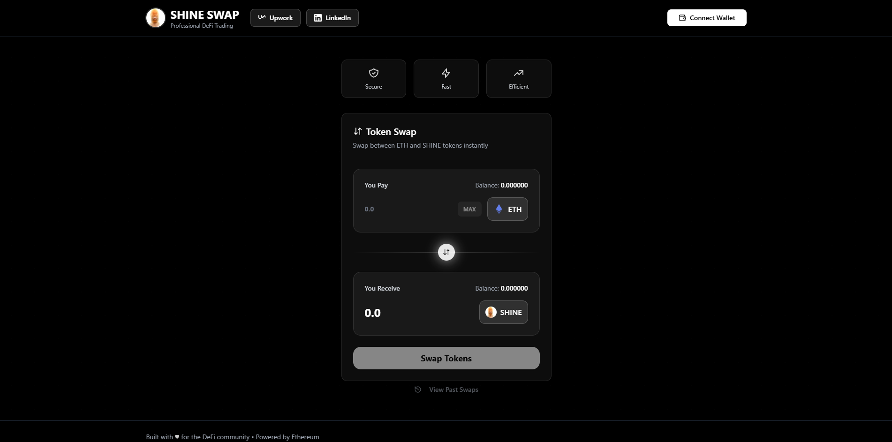

# ShineSwap - Professional DeFi Token Swap DApp



A sleek, professional, and fully functional Decentralized Application (DApp) for swapping between ETH and a custom ERC20 token (SHINE). Built with a modern tech stack, it features a monochrome, animated UI and fetches all transaction history directly from the blockchain.

This project was built to showcase advanced skills in smart contract development, front-end integration, and modern UI/UX design for the DeFi space.

**Live Demo:** [Link to your deployed demo]

---

## ✨ Features

*   **Token Swapping:** Seamlessly swap between ETH and the SHINE ERC20 token.
*   **Liquidity Pool:** Powered by a `ShineSwapLP` smart contract that manages liquidity and calculates prices.
*   **On-Chain Transaction History:** A dedicated view to browse your past 10 swaps, fetched directly from `Swap` events on the Sepolia testnet.
*   **Wallet Integration:** Connects to MetaMask or other Web3 wallets using Ethers.js.
*   **Professional UI:** Built with React, Tailwind CSS, and shadcn/ui for a clean, responsive, and modern monochrome aesthetic.
*   **Live Price Impact & Rates:** Calculates and displays the real-time exchange rate and price impact before you swap.
*   **Animated & Responsive:** Features custom animations for a lively user experience that looks great on both desktop and mobile.
*   **Fee-on-Transfer Token:** The `ShineToken.sol` contract includes an optional fee mechanism that collects a percentage of transfers to reward holders and burn tokens.

---

## 🛠️ Tech Stack

*   **Frontend:** React, Vite, TypeScript, Tailwind CSS, shadcn/ui, Ethers.js
*   **Backend (Smart Contracts):** Hardhat, Solidity, OpenZeppelin Contracts
*   **Blockchain:** Deployed on the Sepolia Testnet

---

## 🚀 Getting Started

### Prerequisites

*   [Node.js](https://nodejs.org/en/) (v18 or later)
*   [MetaMask](https://metamask.io/) browser extension

### Installation & Setup

1.  **Clone the repository:**
    ```bash
    git clone https://github.com/404Piyush/DeFi-Token-Swap-DApp.git
    cd DeFi-Token-Swap-DApp
    ```

2.  **Install project dependencies:**
    ```bash
    npm install
    ```

3.  **Install DApp dependencies:**
    ```bash
    cd shine-swap-pro
    npm install
    cd ..
    ```

4.  **Set up your environment variables:**
    Create a `.env` file in the root directory and add the following, replacing the placeholder values:
    ```
    SEPOLIA_RPC_URL="YOUR_ALCHEMY_OR_INFURA_SEPOLIA_RPC_URL"
    PRIVATE_KEY="YOUR_WALLET_PRIVATE_KEY"
    ```

### Running Locally

1.  **Start the frontend development server:**
    ```bash
    cd shine-swap-pro
    npm run dev
    ```
    The application will be available at `http://localhost:5173`.

2.  **Connect your MetaMask** to the Sepolia testnet to interact with the deployed contracts.

---

## 📜 Smart Contracts

The project contains two main contracts deployed on the Sepolia testnet:

1.  **ShineToken (`0x7C5a0C4fa68c47740Cd51Dd6dFad5E754d019c05`):**
    *   An ERC20 token with an 18-decimal precision.
    *   Includes a fee-on-transfer mechanism that can be toggled by the owner.
    *   [View on Sepolia Etherscan](https://sepolia.etherscan.io/address/0x7C5a0C4fa68c47740Cd51Dd6dFad5E754d019c05)

2.  **ShineSwapLP (`0x476DaA7f3c23C7e46A526c20288CF9e74D08a564`):**
    *   The liquidity pool contract that holds reserves of both ETH and SHINE.
    *   Handles all swap logic, liquidity management, and price calculations.
    *   [View on Sepolia Etherscan](https://sepolia.etherscan.io/address/0x476DaA7f3c23C7e46A526c20288CF9e74D08a564)

---

## 👤 Credit

This project was imagined and built by **Piyush (@404Piyush)**.

*   [GitHub Profile](https://github.com/404Piyush)
*   [Upwork Profile](https://www.upwork.com/freelancers/404piyush)
*   [LinkedIn Profile](https://www.linkedin.com/in/piyush-utkar-0489b12b2) 